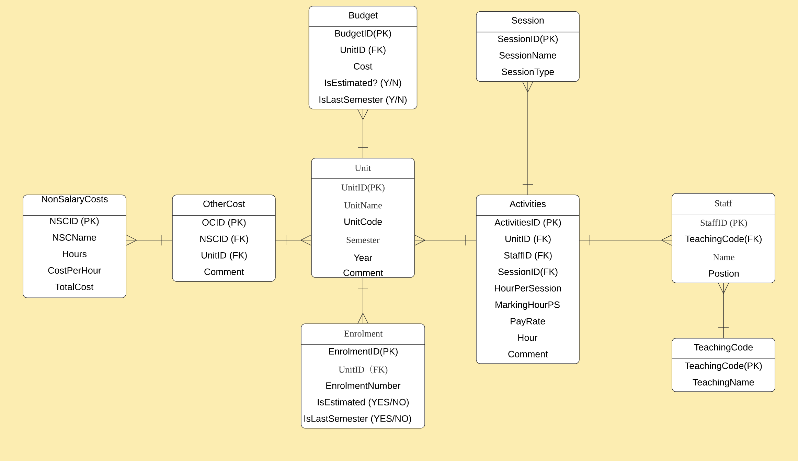
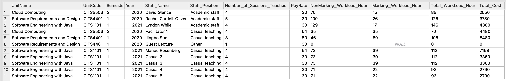
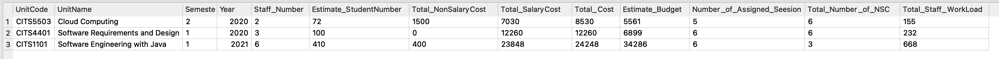

# Unit Budget Planner Database User Guide

 

## User Guide

- [DB Structure](#db_structure)
- [Tables](#tables)
  - [Activities](#activities)
  - [Budget](#budget)
  - [Enrolment](#enrolment)
  - [NonSalaryCosts](#nonsalarycosts)
  - [OtherCost](#othercost)
  - [Session](#session)
  - [Staff](#staff)
  - [TeachingCode](#teachingcode)
  - [Unit](#unit)
- [View Tables](#viewtable)
  - [Staff Detail View Tables](#staffdetail_view)
  - [Unit Detail View Tables](#unitdetail_view)

 

## DB_Structure

 

## Tables

### Activities

- Table Creation Schema DDL

<pre>

CREATE TABLE IF NOT EXISTS Activities (
    ActivitiesID INTEGER PRIMARY KEY AUTOINCREMENT,
    UnitID INT REFERENCES Unit (UnitID) ON DELETE RESTRICT ON UPDATE CASCADE,
    StaffID INT REFERENCES Staff (StaffID) ON DELETE RESTRICT ON UPDATE CASCADE,
    SessionID INT REFERENCES Session (SessionID) ON DELETE RESTRICT ON UPDATE CASCADE,
    HourPerSession INT,
    MarkingHourPS REAL,
    PayRate REAL,
    Hour REAL,
    Comment VARCHAR (300) 
);
</pre>

- Insert Data DDL

<pre>

INSERT INTO Activities(UnitID, StaffID, SessionID, HourPerSession, MarkingHourPS, PayRate, Hour, Comment) VALUES(UnitID, StaffID, SessionID, HourPerSession, MarkingHourPS, PayRate, Hour, Comment);

<b>***Sample Insert***</b>

INSERT INTO Activities (UnitID, StaffID, SessionID, HourPerSession, MarkingHourPS, PayRate, Hour, Comment) VALUES(1, 1, 1, 4, 0.25, 30,40, "Good");

</pre>

- Update Data DDL

<pre>

UPDATE Activities
SET MarkingHourPS = 0.5,
    Hour = 100,
    Comment = 'Not Good'
WHERE
    UnitID = 1 and StaffID = 1 and SessionID = 1;
</pre>

- Insert Data Python Code

<pre>

activity = [1,1,1,4,0.25,30,60,"Good"]

def insert_activities(conn, act):
    sql = ''' INSERT INTO Activities (UnitID, StaffID, SessionID, HourPerSession, MarkingHourPS, PayRate,Hour, Comment) 
    VALUES(?, ?, ?, ?, ?, ?, ?, ?);'''
    cur = conn.cursor()
    data_check=cur.execute(sql, act)
    # Check if data already exist
    if data_check is None:
      cur.execute(sql, act)
      conn.commit()
    else:
      conn.commit()
      return cur.lastrowid
</pre>

### Budget

<b>Note: IsEstimated & IsLastSemester can only be 'YES' or 'NO'</b>
- Table Creation Schema DDL

<pre>

CREATE TABLE IF NOT EXISTS Budget (
        BudgetID INTEGER PRIMARY KEY AUTOINCREMENT,
        UnitID INT REFERENCES Unit (UnitID) ON DELETE RESTRICT ON UPDATE CASCADE,
        Cost INT,
        IsEstimated VARCHAR (3),
        IsLastSemester VARCHAR (3) 
);
</pre>

- Insert Data DDL

<pre>

INSERT INTO Budget(UnitID, Cost, IsEstimated, IsLastSemester) VALUES(UnitID, Cost, IsEstimated, IsLastSemester);

<b>***Sample Insert***</b>

INSERT INTO Budget(UnitID, Cost, IsEstimated, IsLastSemester) VALUES(1, 30000, 'YES', 'NO');

</pre>

- Update Data DDL

<pre>

UPDATE Budget
SET Cost = 10000,
    IsEstimated = 'NO'
WHERE
    UnitID = 1;
</pre>

- Insert Data Python Code

<pre>

budget = [1,30000,'YES','NO']

def insert_budget(conn, budget):
    sql = ''' INSERT INTO Budget(UnitID, Cost, IsEstimated, IsLastSemester) 
    VALUES(?,?,?,?); '''
    cur = conn.cursor()
    data_check=cur.execute(sql, budget)
    # Check if data already exist
    if data_check is None:
      cur.execute(sql, budget)
      conn.commit()
    else:
      conn.commit()
      return cur.lastrowid
</pre>

### Enrolment

<b>Note: IsEstimated & IsLastSemester can only be 'YES' or 'NO'</b>
- Table Creation Schema DDL

<pre>

CREATE TABLE IF NOT EXISTS Enrolment (
        EnrolmentID INTEGER PRIMARY KEY AUTOINCREMENT,
        UnitID INT REFERENCES Unit (UnitID) ON DELETE RESTRICT ON UPDATE CASCADE,
        EnrolmentNumber INT,
        IsEstimated VARCHAR (3),
        IsLastSemester VARCHAR (3) 
);
</pre>

- Insert Data DDL

<pre>

INSERT INTO Enrolment(UnitID, EnrolmentNumber, IsEstimated, IsLastSemester) VALUES(UnitID, EnrolmentNumber, IsEstimated, IsLastSemester);

<b>***Sample Insert***</b>

INSERT INTO Enrolment(UnitID, EnrolmentNumber, IsEstimated, IsLastSemester) VALUES(1, 300, 'YES', 'NO');

</pre>

- Update Data DDL

<pre>

UPDATE Enrolment
SET EnrolmentNumber = 1000,
    IsEstimated = 'NO'
WHERE
    UnitID = 1;
</pre>

- Insert Data Python Code

<pre>

enrol = [1,200,'Yes','No']

def insert_enrolment(conn, enrol):
    sql = ''' Insert into Enrolment(UnitID,EnrolmentNumber,IsEstimated,IsLastSemester)
              VALUES(?,?,?,?) '''
    cur = conn.cursor()
    data_check=cur.execute(sql, enrol)
    # Check if data already exist
    if data_check is None:
      cur.execute(sql, enrol)
      conn.commit()
    else:
      conn.commit()
      return cur.lastrowid
</pre>

### NonSalaryCosts

<b>Note: NSCName + CostPerHour must be unique in the table</b>
  
- Table Creation Schema DDL

<pre>

CREATE TABLE IF NOT EXISTS NonSalaryCosts (
        NSCID INTEGER PRIMARY KEY AUTOINCREMENT,
        NSCName VARCHAR (50),
        Hours REAL,
        CostPerHour REAL,
        TotalCost REAL,
        UNIQUE (NSCName, CostPerHour) ON CONFLICT FAIL
);
</pre>

- Insert Data DDL

<pre>

INSERT INTO NonSalaryCosts(NSCName, Hours, CostPerHour, TotalCost) VALUES (NSCName, Hours, CostPerHour, TotalCost);

<b>***Sample Insert***</b>

INSERT INTO NonSalaryCosts(NSCName, Hours, CostPerHour, TotalCost) VALUES ("Play", 60, 23.5, 1314.5);

</pre>

- Update Data DDL

<pre>

UPDATE NonSalaryCosts
SET Hours = 1000
WHERE 
     NSCName = "Play" and CostPerHour = 23.5;
</pre>

- Insert Data Python Code

<pre>

nsc = ["Lecture",6,10,60]

def insert_nsc(conn, nsc):
    sql = ''' Insert into NonSalaryCosts(NSCName,Hours,CostPerHour,TotalCost)
              VALUES(?,?,?,?) '''
    cur = conn.cursor()
    data_check=cur.execute(sql, nsc)
    # Check if data already exist
    if data_check is None:
      cur.execute(sql, nsc)
      conn.commit()
    else:
      conn.commit()
      return cur.lastrowid
</pre>

### OtherCost
  
- Table Creation Schema DDL

<pre>

CREATE TABLE IF NOT EXISTS OtherCost (
        OCID INTEGER PRIMARY KEY AUTOINCREMENT,
        NSCID INT REFERENCES NonSalaryCosts (NSCID) ON DELETE RESTRICT ON UPDATE CASCADE,
        UnitID INT REFERENCES Unit (UnitID) ON DELETE RESTRICT ON UPDATE CASCADE,
        Comment VARCHAR (300)
);
</pre>

- Insert Data DDL

<pre>

INSERT INTO OtherCost(NSCID, UnitID, Comment) VALUES (NSCID, UnitID, Comment);

<b>***Sample Insert***</b>

INSERT INTO OtherCost(NSCID, UnitID, Comment) VALUES (1, 1, "Good");

</pre>

- Update Data DDL

<pre>

UPDATE OtherCost
SET Comment = "Bad"
WHERE 
     NSCID = 1 and UnitID = 1;
</pre>

- Insert Data Python Code

<pre>

oc = [1,6,"Good"]

def insert_oc(conn, oc):
    sql = ''' INSERT INTO OtherCost(NSCID, UnitID, Comment) 
    VALUES (?,?,?); '''
    cur = conn.cursor()
    data_check=cur.execute(sql, oc)
    # Check if data already exist
    if data_check is None:
      cur.execute(sql, oc)
      conn.commit()
    else:
      conn.commit()
      return cur.lastrowid
</pre>

### Session

<b>Note: SessionName must be unique</b>
<b>Note: SessionType must be 'M' (Marking) or 'NM' (Non Marking) </b>
  
- Table Creation Schema DDL

<pre>

CREATE TABLE IF NOT EXISTS Session (
        SessionID INTEGER PRIMARY KEY AUTOINCREMENT,
        SessionName VARCHAR (50) UNIQUE,
        SessionType VARCHAR (10) 
);
</pre>

- Insert Data DDL

<pre>

INSERT INTO Session(SessionName, SessionType) VALUES (SessionName, SessionType);

<b>***Sample Insert***</b>

INSERT INTO Session(SessionName, SessionType) VALUES ("Good", "NM");

</pre>

- Insert Data Python Code

<pre>

session = ["Lecture","NM"]

def insert_session(conn, session):
    sql = ''' Insert into Session(SessionName,SessionType)
              VALUES(?,?) '''
    cur = conn.cursor()
    data_check=cur.execute(sql, session)
    # Check if data already exist
    if data_check is None:
      cur.execute(sql, session)
    else:
      conn.commit()
      return cur.lastrowid
</pre>

### Staff

<b>Note: Name + Position must be unique in the table</b>
  
- Table Creation Schema DDL

<pre>

CREATE TABLE IF NOT EXISTS Staff (
        StaffID INTEGER PRIMARY KEY AUTOINCREMENT,
        TeachingCode INT REFERENCES TeachingCode (TeachingCode) ON DELETE RESTRICT ON UPDATE CASCADE,
        Name VARCHAR (50),
        Position  VARCHAR (30),
        UNIQUE (Name, Position)ON CONFLICT FAIL
);
</pre>

- Insert Data DDL

<pre>

INSERT INTO Staff(TeachingID, Name, Position) VALUES (TeachingID, Name, Position);

<b>***Sample Insert***</b>

INSERT INTO Staff(TeachingID, Name, Position) VALUES (1, "Rachel", "Staff");

</pre>

- Insert Data Python Code

<pre>

staff = [1,"Racheal","Lecture"]

def insert_staff(conn, staff):
    sql = ''' Insert into Staff(TeachingID,Name,Position)
              VALUES(?,?,?) '''
    cur = conn.cursor()
    data_check=cur.execute(sql, staff)
    # Check if data already exist
    if data_check is None:
      cur.execute(sql, staff)
      conn.commit()
    else:
      conn.commit()
      return cur.lastrowid
</pre>

### TeachingCode

<b>Note: TeachingName must be unique</b>

- Table Creation Schema DDL

<pre>

CREATE TABLE IF NOT EXISTS TeachingCode (
        TeachingCode INTEGER PRIMARY KEY AUTOINCREMENT,
        TeachingName VARCHAR (50) UNIQUE
);
</pre>

- Insert Data DDL

<pre>

INSERT INTO TeachingCode(TeachingName) VALUES (TeachingName);

<b>***Sample Insert***</b>

INSERT INTO TeachingCode(TeachingName) VALUES ("ORAA");

</pre>

- Insert Data Python Code

<pre>

TeachingCode = ["ORAA"]

def insert_teachingcode(conn, TeachingCode):
    sql = ''' Insert into TeachingCode(TeachingName)
              VALUES(?) '''
    cur = conn.cursor()
    data_check=cur.execute(sql, TeachingCode)
    # Check if data already exist
    if data_check is None:
      cur.execute(sql, TeachingCode)
    else:
      conn.commit()
      return cur.lastrowid
</pre>

### Unit

<b>Note: TeachingName must be unique</b>

- Table Creation Schema DDL

<pre>

CREATE TABLE IF NOT EXISTS Unit (
        UnitID INTEGER PRIMARY KEY AUTOINCREMENT,
        UnitName VARCHAR (100),
        UnitCode VARCHAR (10),
        Semester VARCHAR (10),
        Year INT (4),
        Comment VARCHAR (300)
);
</pre>

- Insert Data DDL

<pre>

INSERT INTO Unit(UnitName, UnitCode, Semester, Year, Comment) VALUES (UnitName, UnitCode, Semester, Year, Comment);

<b>***Sample Insert***</b>

INSERT INTO Unit(UnitName, UnitCode, Semester, Year, Comment) VALUES ("Computing", "CITS1101", "SEM-1", 2021, "Pass");

</pre>

- Insert Data Python Code

<pre>

Unit = ["Computing","CITS2021","SEM-2",2020,"Fail"]

def insert_unit(conn, unit):
    sql = ''' INSERT INTO Unit(UnitName,UnitCode,Semester,Year,Comment)
              VALUES(?,?,?,?,?) '''
    cur = conn.cursor()
    data_check=cur.execute(sql, unit)
    # Check if data already exist
    if data_check is None:
      cur.execute(sql, unit)
    else:
      conn.commit()
      return cur.lastrowid
</pre>

## ViewTable

### StaffDetail_View

- Structure

<pre>

Table Name: StaffDetail
- UnitName
- UnitCode
- Semester
- Year
- Staff_Name
- Staff_Position
- Number_of_Sessions_Teached
- PayRate
- NonMarking_Workload_Hour
- Marking_Workload_Hour
- Total_Workload_Hour
- Total_Cost

</pre>

- Sample Query

<pre>

Select * From StaffDetail Where UnitCode = "CITS1101";

</pre>

- Schema

<pre>

CREATE VIEW StaffDetail
AS
Select UnitName, UnitCode, Semester, Year, T1.Name AS Staff_Name, T1.Position AS Staff_Position, 
(Select COUNT(T1.StaffID) AS Total_Sessions_Teached
From Activities A5 JOIN Session S5 USING (SessionID)
                JOIN Staff T5 USING (StaffID)
                JOIN Unit U5 USING (UnitID)
                JOIN TeachingCode P5 USING (TeachingCode)
Where A5.StaffID = A1.StaffID
Group By T5.StaffID) AS Number_of_Sessions_Teached
,A1.PayRate, 
(Select SUM(Hour) as NonMarking_Workload
From Activities A2 JOIN Session S2 USING (SessionID)
                JOIN Staff T2 USING (StaffID)
                JOIN Unit U2 USING (UnitID)
                JOIN TeachingCode P2 USING (TeachingCode)
Where S2.SessionType = "NM" and A2.StaffID = A1.StaffID
Group by T2.StaffID) AS NonMarking_Workload_Hour,
(Select SUM(Hour) as NonMarking_Workload
From Activities A3 JOIN Session S3 USING (SessionID)
                JOIN Staff T3 USING (StaffID)
                JOIN Unit U3 USING (UnitID)
                JOIN TeachingCode P3 USING (TeachingCode)
Where S3.SessionType = "M" and A3.StaffID = A1.StaffID
Group by T3.StaffID) AS Marking_Workload_Hour,
SUM(Hour) as Total_WorkLoad_Hour, A1.PayRate*SUM(Hour) AS Total_Cost
From Activities A1 JOIN Session S1 USING (SessionID)
                JOIN Staff T1 USING (StaffID)
                JOIN Unit U1 USING (UnitID)
                JOIN TeachingCode P1 USING (TeachingCode)
Group by T1.StaffID

</pre>

### UnitDetail_View

- Structure

<pre>

Table Name: UnitDetail
- UnitCode
- UnitName
- Semester
- Year
- Staff_Number
- Estimate_StudentNumber
- Total_NonSalaryCost
- Total_SalaryCost
- TotalCost
- Estimate_Budget
- Number_of_Assigned_Session
- Total_Number_of_NSC
- Total_Staff_WorkLoad

</pre>

- Sample Query

<pre>

Select * From UnitDetail Where UnitCode = "CITS1101";

</pre>

- Schema

<pre>

CREATE VIEW UnitDetail
AS
Select U.UnitCode, U.UnitName,U.Semester,U.Year,
(Select COUNT(DISTINCT P.Name)
From Activities A JOIN Staff P USING (StaffID)
JOIN Unit R USING (UnitID)
Where R.UnitCode = U.UnitCode
) AS Staff_Number,
(Select EnrolmentNumber
From Enrolment JOIN Unit USING (UnitID)
Where IsEstimated = "YES" and IsLastSemester = "NO" and Unit.UnitID = U.UnitID) AS Estimate_StudentNumber,
(Select SUM(N.TotalCost) 
From OtherCost O JOIN NonSalaryCosts N USING (NSCID)
JOIN UNIT Z USING (UnitID)
Where Z.UnitID = U.UnitID
Group by Z.UnitID) AS Total_NonSalaryCost,
(Select SUM(A1.PayRate*Hour) AS Total_Cost
From Activities A1 JOIN Session S1 USING (SessionID)
                JOIN Staff T1 USING (StaffID)
                JOIN Unit U1 USING (UnitID)
                JOIN TeachingCode P1 USING (TeachingCode)
Where U1.UnitID = U.UnitID
Group by U1.UnitID ) AS Total_SalaryCost
,
(Select SUM(N.TotalCost) 
From OtherCost O JOIN NonSalaryCosts N USING (NSCID)
JOIN UNIT Z USING (UnitID)
Where Z.UnitID = U.UnitID
Group by Z.UnitID)
+(Select SUM(A1.PayRate*Hour) AS Total_Cost
From Activities A1 JOIN Session S1 USING (SessionID)
                JOIN Staff T1 USING (StaffID)
                JOIN Unit U1 USING (UnitID)
                JOIN TeachingCode P1 USING (TeachingCode)
Where U1.UnitID = U.UnitID
Group by U1.UnitID ) AS Total_Cost
,
(Select B.Cost
From Unit G JOIN Budget B USING (UnitID)
Where IsEstimated = "YES" and B.IsLastSemester = "NO" and G.UnitID = U.UnitID ) AS Estimate_Budget,
(Select COUNT(DISTINCT(SessionID))
From Activities
Where Activities.UnitID = U.UnitID
Group BY UnitID) AS Number_of_Assigned_Seesion,
(Select COUNT(*) 
From OtherCost O JOIN Unit L USING (UnitID)
JOIN NonSalaryCosts USING (NSCID)
Where L.UnitID = U.UnitID
Group by L.UnitID) AS Total_Number_of_NSC,
(Select SUM(A.Hour)
From Activities A JOIN Unit N USING (UnitID)
Where N.UnitID = U.UnitID
Group by N.UnitID) AS Total_Staff_WorkLoad
From Activities A JOIN Staff S USING (StaffID) 
                              JOIN Session E USING (SessionID)
                              JOIN Unit U USING (UnitID)
Group By U.UnitID

</pre>

