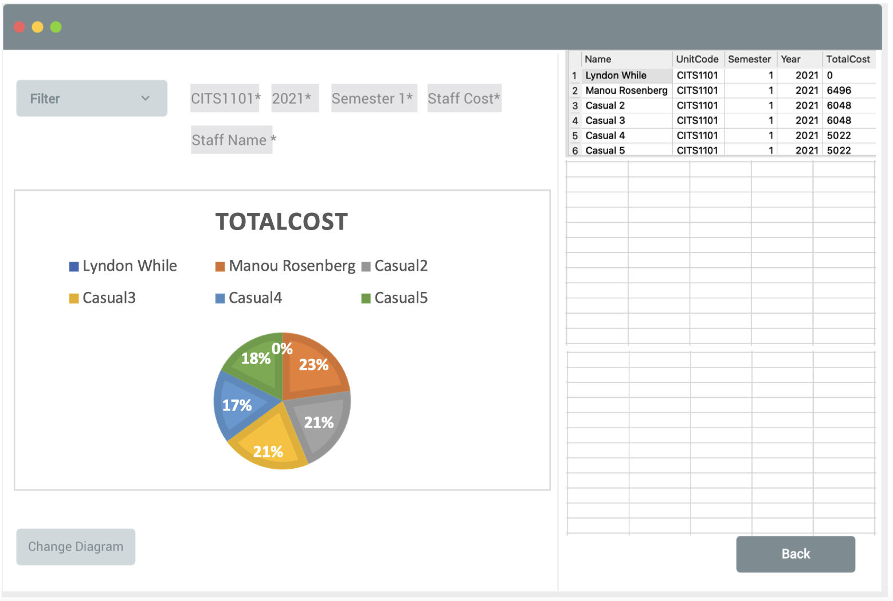

# Deliverable 2

## How to Launch the Application

<b>1. Set up<b>

### Requirement 

**In order to use the interface, will require to install node.js at https://nodejs.org/en/download/ and install python3 (require to have python(3.5 and above), can be find at https://www.python.org/downloads/**

### Install virtual Environment

#### * For MacOS and Linux User

<pre>

cd Unit_Budget

python3 -m venv venv 

source venv/bin/activate

</pre>

You need to install the packages inside the [<b>requirements.txt<b>](./Unit_Budget/Python_File/requirements.txt). Run the following code.

<pre>

pip3 install -r ./Python_File/requirements.txt

</pre>
or 
<pre>

pip install -r ./Python_File/requirements.txt

</pre>

Then start the application
  
<pre>

npm install

npm start

</pre>
  
#### * For Windows User

<pre>

cd Unit_Budget

python3 -m venv venv OR py -m venv venv

Set-ExecutionPolicy Unrestricted -Scope Process

venv/Scripts/activate

</pre>

You need to install the packages inside the [<b>requirements.txt<b>](./Unit_Budget/Python_File/requirements.txt). Run the following code.

<pre>

pip3 install -r ./Python_File/requirements.txt

</pre>
or 
<pre>

pip install -r ./Python_File/requirements.txt

</pre>

Then start the application
  
<pre>

npm install

npm start

</pre>

# CITS5206 Professional Computing Project - Unit Budget Planner

## Client
<b>Rachel Cardell-Oliver</b> - Head of Department, UWA Computer Science

## Team Member
- Ethan Chen 23067035
- Liangbo Jin 23078811
- Lida Tong 22957193
- Yu Zhu 23053734
- Nara Eam 22805226
- Keli Yin 22450718

## Group Meeting

- Schedule
  - Every <b>Thursday 4pm</b>, details can be accessed [<b>here</b>](./Group_Meeting/Meeting_Record/20210729_Meeting_Minutes).

- Meeting Agenda (Accessed [Here](./Group_Meeting))
- Group Meeting Record, access files [here](./Group_Meeting/Meeting_Record)

## Resources

### Project Details

Every unit taught in the School of PMC has a unit budget each semester to document the hours allocated to preparation and delivery of teaching activities and marking. It also documents casual salary costs and any software or hardware costs. The current system is based on individual spreadsheets for each unit. The spreadsheet system is cumbersome to set up for every unit each semester and it is difficult to break down the hours and costs of different types of activities for delivering units. Summary reports are needed in order to understand the costs in workload hours and paid casual teaching, for comparing the budgets of different groups of units and to track budget expenditure during the semester.

The software will:

- Create a database for managing current and historical unit budgets.
- Create a user interface for entering or updating unit budget information.
- Enable managers to produce summary reports for a group of units and the breakdown of their costs.
- Additional functionalities (if time permits):

- Import enrolment numbers in order to update automatically budget items that depend on class size.
- Import cost information in order to track unit expenditure against the budget.
- Visualise and export reports on historical trends of enrolments and budgets.

### Marking Criteria

- [Deliverable 1](./Project_Details/Deliverable_1_Details.docx) 15% ( 10% Group, 5% Individual ) <b>Due: 27/08/2021</b>
- [Deliverable 2](./Project_Details/) 25% ( 25% Individual ) <b>Due: Week 8</b>
- [Deliverable 3](./Project_Details/) 30% ( 20% Group, 10% Individual ) <b>Due: Week 12</b>

### Client Requirements
- The app should be in a desktop format 
- The system shall allow the user to import the spreadsheet, or group of spreadsheets
- The system should be able to produce and filter summary report  
- The system shall allow user to type in their own SQL query
- The system should be able to store the comment from the spreadsheet  
- The system should allow the user to pull up the comment and check if there is actual anomaly happen.
- The system shall be able to track the historical budget for user
- The system shall provide different interface for different users according to their roles such as Unit Coordinator and Head of department

