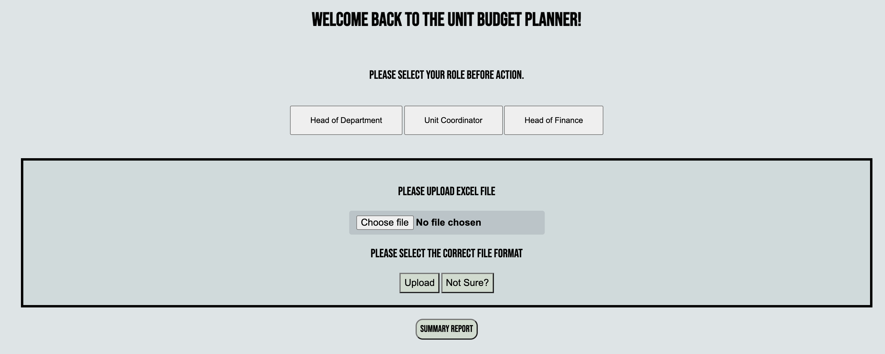

# CITS5206 Professional Computing Project - Unit Budget Planner
# Client
<b>Rachel Cardell-Oliver</b> - Head of Department, UWA Computer Science
# User Manual
- [<b>How to Start the Application</b>](./StarApplication.md)
- [<b>Group Details</b>](#group-details)
  - [<b>Group Member</b>](#team-member)
  - [<b>Group Meeting files</b>](#group-meeting)
  - [<b>Group Contribution</b>](#group-project-contribution)
- [<b>Project Detail</b>](#project-details)
- [<b>Database Structure</b>](./DB_User_Guide.md)
- [<b>Supported Testing</b>](#support-testing-files)
  - [<b>Database Related Testing</b>](./Unit_Budget/DB_testing.md)
  - [<b>User Interface Related Testing</b>](./Unit_Budget/tests/User_Interface_testing.md)

 
 

# Group Details
## Team Member
- Ethan Chen 23067035
- Liangbo Jin 23078811
- Lida Tong 22957193
- Yu Zhu 23053734
- Nara Eam 22805226
- Keli Yin 22450718

## Group Meeting

- Meeting Schedule
  - Every <b>Thursday 4pm</b>, details can be accessed [<b>Here</b>](./Group_Meeting/Meeting_Record/20210729_Meeting_Minutes).

- All Meeting Agenda file (Accesses [<b>Here</b>](./Group_Meeting))

- All Group Meeting Records (Accesses [<b>Here</b>](./Group_Meeting/Meeting_Record))

## Group Project Contribution

|     Name     |      Contribution     | 
|--------------|:---------------------:|
| Liangbo Jin 23078811 |  0%       |
| Ethan Chen 23067035 |    0%          |
| Lida Tong 22957193 | 0%       |
| Nara Eam 22805226 | 0%       |
| Yu Zhu 23053734 | 0%       |
| Keli Yin 22450718 | 0%       |

See details and evidence [<b>Here</b>](./Group_Conbtribution.pdf)

 
 

# Project Details

Every unit taught in the School of PMC has a unit budget each semester to document the hours allocated to preparation and delivery of teaching activities and marking. It also documents casual salary costs and any software or hardware costs. The current system is based on individual spreadsheets for each unit. The spreadsheet system is cumbersome to set up for every unit each semester and it is difficult to break down the hours and costs of different types of activities for delivering units. Summary reports are needed in order to understand the costs in workload hours and paid casual teaching, for comparing the budgets of different groups of units and to track budget expenditure during the semester.

The software will:

- Create a database for managing current and historical unit budgets.
- Create a user interface for entering or updating unit budget information.
- Enable managers to produce summary reports for a group of units and the breakdown of their costs.
- Additional functionalities (if time permits):

- Import enrolment numbers in order to update automatically budget items that depend on class size.
- Import cost information in order to track unit expenditure against the budget.
- Visualise and export reports on historical trends of enrolments and budgets.

 
 

# Support Testing Files

- Database related testing guide, refer to [<b>Here</b>](./Unit_Budget/DB_testing.md)
- User Interface related testing guide, refer to [<b>Here</b>](./Unit_Budget/tests/User_Interface_testing.md)
