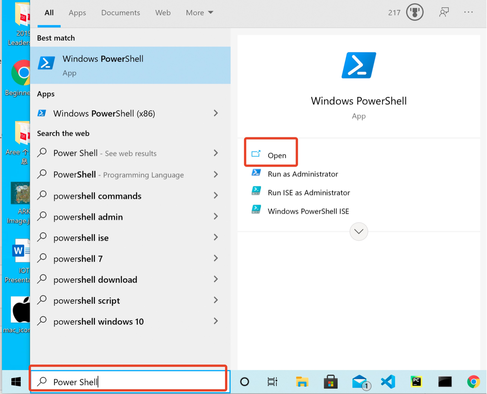
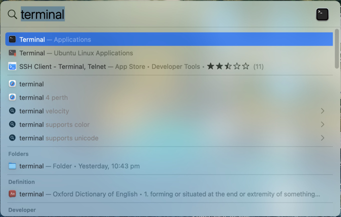

# User Guide for Starting the Application

## Supported System
- <b>Windows</b> [Access the Windows setup guide](#windows-setup-guide)
- <b>MacOS</b> [Access the Mac setup guide](#macos-setup-guide)
- <b>Linux </b> [Access the Mac setup guide](#linux-setup-guide)

## Software Requirements
- <b>Python</b>: Click [Here](https://www.python.org/downloads/) to download the latest Python
- <b>Node.js</b>: Click [Here](https://nodejs.org/en/download/) to download node.js

 

# Windows Setup Guide

 
 
## You need to download [Python](https://www.python.org/downloads/) and [Node.js](https://nodejs.org/en/download/)
  

1. <b>Search 'Power Shell' in search box, and open the Power Shell. </b>

  
2. <b>Copy the following commands in PowerShell, and start the application.</b>  
<b> Tips: You can copy all codes in once and paste into powershell</b>
<pre>

cd .\Desktop\

git clone https://github.com/WentworthJin/Unit_Budget_Planner.git

cd .\Unit_Budget_Planner\Unit_Budget\

pip3 install --upgrade pip

python3 -m venv venv

Set-ExecutionPolicy Unrestricted -Scope Process

.\venv\Scripts\activate

pip3 install -r .\Python_File\requirements.txt

npm install

npm start
</pre>

3. <b>If you encountered any errors and the application closed, just re-type 'npm start' in PowerShell</b>
  

  

4. <b>For future use, please open the PowerShell, and copy the following commands</b>

<pre>

cd .\Desktop\Unit_Budget_Planner\Unit_Budget\

Set-ExecutionPolicy Unrestricted -Scope Process

.\venv\Scripts\activate

npm start

</pre>

 
 

# MacOS Setup Guide

 
 
## You need to download [Python](https://www.python.org/downloads/) and [Node.js](https://nodejs.org/dist/v14.18.1/node-v14.18.1.pkg)
  

1. <b>Hold 'command + space' and search for 'Terminal', and open the Terminal </b>

  
2. <b>Copy the following commands in Terminal, and start the application.</b> 
<b> Tips: You can copy all codes in once and paste into Terminal</b> 
<pre>

cd Desktop/

git clone https://github.com/WentworthJin/Unit_Budget_Planner.git

cd Unit_Budget_Planner

python3 -m venv venv

source venv/bin/activate

mv .zshrc ~/.zshrc

source ~/.zshrc

cd Unit_Budget

pip3 install --upgrade pip

pip3 install -r ./Python_File/requirements.txt

npm install

npm start
</pre>

3. <b>If you encountered any errors and the application closed, just re-type 'npm start' in Terminal</b>
  

  

4. <b>For future use, please open the Terminal, and copy the following commands</b>

<pre>

cd Desktop/Unit_Budget_Planner

source venv/bin/activate

npm start

</pre>

 
 

# Linux Setup Guide

 
 

1. <b>Open the Terminal </b>
  
2. <b>Copy the following commands in Terminal, and start the application.</b> 
<pre>

cd Desktop/

git clone https://github.com/WentworthJin/Unit_Budget_Planner.git

</pre>

<pre>

cd Unit_Budget_Planner

sudo apt-get update

sudo apt-get upgrade

sudo apt-get install python3-venv

python3 -m venv venv

source venv/bin/activate

sudo apt install nodejs

sudo apt install npm

cd Unit_Budget

pip3 install --upgrade pip

pip3 install -r ./Python_File/requirements.txt

npm install

npm start
</pre>

3. <b>If you encountered any errors and the application closed, just re-type 'npm start' in Terminal</b>
  

  

4. <b>For future use, please open the Terminal, and copy the following commands</b>

<pre>

cd Desktop/Unit_Budget_Planner

source venv/bin/activate

npm start

</pre>
